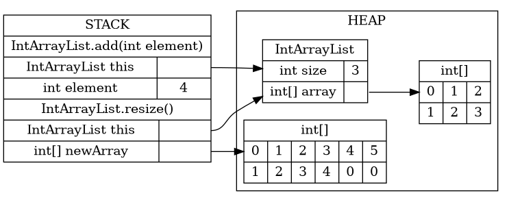
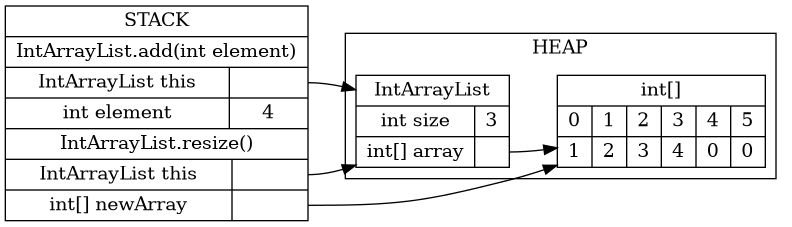

# Worksheet 2: ArrayLists and LinkedLists
# Due 9/11 11:59 pm

Collaborators:

## Review
1. In your own words, explain what an ArrayList is.  
  
  An ArrayList is an ordered data type where each element is referenced by an index. The number of elements (size) of this index is fixed, though some may be set to null. The only way to expand the ArrayList is to create an ArrayList with a larger size, copy over all the data, and then assign it the same reference variable as the original list. Similarly, the only way to insert an element into an ArrayList is to shift all following elements over by an index value.

2. In your own words, explain what a LinkedList is. How is it different from an ArrayList?  
  
  A LinkedList is an ordered data type where each element is stored as a node  containing a piece of data and pointer(s) to the next/previous node(s). Singly-linked lists only have pointers to the next node, while doubly-linked ones have pointers to the next and previous nodes. This is different from an ArrayList because the size is not fixed as elements are stored using dynamic memory allocation, meaning more space is devoted to storing the LinkedList as more nodes are created. As a result, nodes can be added and deleted. Additionally, nodes can be inserted by changing the pointers of the previous (in the case of singly-linked lists) and following (in the case of doubly-linked lists) nodes. 

## Exploration

1. In this question, you will recreate the Java code to build an ArrayList. The intention is that, after watching the live-coding videos (in Moodle in Week 2, Panopto Link, Prof Rabkina), you should be able to *independently* think through how an ArrayList works, and to write the code from scratch. I encourage you to do this section of the worksheet *without* referring to the videos.

    You can download the starter code in `MyArrayList.java` and work in Eclipse. I recommend using Github Desktop (or commandline git, if you're comfortable with it) to make updating your repo easier.

    Remember to test and save often. The `main()` in `MyArrayList.java` already has some tests, although you will not pass all of them in this section (resizing the list is left for the Challenge section below). In addition to answering the questions here, you should also submit your code to [the autograder](http://autograder.cc.oxy.edu/), which will run the test cases for you.  
       
     a. First, we need to be able to create an MyArrayList. Find the public constructor method. What member variables will it need to set? Add those member variables at the first `FIXME`, above the method declaration.   
      _Note_: Java does not allow us to instantiate generic arrays. We can get around this by creating an `Object` array and [casting](https://www.geeksforgeeks.org/class-type-casting-in-java/) it to the generic type. For example: `T[] arr = (T[]) new Object [len];`  
        
      Method variables:
      - `int size`  
      - `T[] array`  
    
   b. Fill in the missing code inside the constructor, making sure to set the member variables you just added.	  

   c. This is an easy one - we should be able to quickly check the current size of our MyArrayList. Fix the `size()` method to return the current actual size.	

   d. Now that we can create an MyArrayList and check its size, let's start putting elements in there. Fill in the `add()` method, which adds a given element to the end of an MyArrayList. You do *not* need to worry about resizing for now; that is left for the Challenge section below.  		

   e. Once we have put a few variables inside our MyArrayList, we should be able view them. Fix the` get()` method, which takes an index and returns the element that is at index in the MyArrayList.

2. In this question, you will recreate the Java code to build a LinkedList. The intention is that, after watching the live-coding videos, you should be able to *independently* think through how a LinkedList works, and to write the code from scratch. I encourage you to do this section of the worksheet *without* referring to the videos.

    You can download the starter code in `MyLinkedList.java` and work in Eclipse. I recommend using Github Desktop (or commandline git, if you're comfortable with it) to make updating your repo easier.        
      
      a. First, we need to create the inner Node class. What member variables does it need? What information is stored in each of these member variables? Write the code for these member variables, and initialize them in the Node constructor.  
        
      Method variables:
      - `Node pointer`  
      - `T data`  
  
    b. What are the member variables of the MyLinkedList class? What information is stored in each of these member variables? What should they be initialized to? Write the code for these member variables, and initialize them in the MyLinkedList constructor. Consider where the `head` and `tail` pointers, in particular, should point.  
      
    Method variables:
    - `int size` (initialized to 0, stores number of nodes in list) 
    - `Node head` (initialized to null, stores refference variable to first node)  
    - `Node tail` (initialized to null, stores refference variable to last node)  
      
    c. Another easy one - fill out the code for `size()`, which should return the current number of elements in our MyLinkedList.  
      
    d. For a singly-linked list, there are two cases we have to think about for `add()`. What are those cases? What should be done in each case? Write the code for `add()` when you understand what should happen in each case.   
      
    Cases:  
    - element is being added to empty list (create Node for element, set as head and tail, set Node pointer to null)  
    - element is being added to a list with at least one other element (create Node for element, set current tail's pointer to Node, set Node as tail, set Node pointer to null)  
  
    e. The next method, `get()` requires looping through the nodes to get to the correct index. Fill in the code for `get()`.  

## Challenge

Remember to submit your code to the [autograder](http://autograder.cc.oxy.edu/)!

1. To complete our ArrayList implementation, we need to add two more methods: `remove()` and `resize()`.    
    
   a. Implement the `remove()` method, which removes the element at a given index in an MyArrayList.  
     
   b. The `resize()` method is a bit more complicated. The memory diagrams, below, show what we want to happen step-by-step. Implement the `resize()` method, referring to the diagrams. Note that this is a private method that does not take any arguments and does not return anything.

    
    
    

    c. Finally, update your `add()` method to make use of `resize()`. Your implementation of MyArrayList is now complete.

3. To complete our MyLinkedList implementation, we only need to add one method: `remove()`.    
  
    a. Why do we _not_ need a `resize()` method for MyLinkedList?  
      
    Unlike ArrayLists, LinkedLists use aren't initialized with a fixes size, so elements can be added indefinatly by creating new Nodes. 
      
    b. The code for the `remove()` method can be broken down into four cases. What are they? What should the code do in each case?  
      
    Cases: 
    - element being removed in the only one in the list (set list head and tail to null, set size to 0)  
    - element being removed is list head (set head's pointer as head, decrease size by one)  
    - element being removed is list tail (set Node before tail as tail (set new tail Node's pointer to null, decrease size by one)  
    - element is niether head nor tail (set Node before element's pointer to Node after element, decrease size by one)   
      
    c. Write the code for `remove()`.  Your implementation of MyLinkedList is now complete.

4. Sections 4.6-4.8 of Zybooks describe a data structure called the doubly-linked list. in short, the main distinguishing feature of a doubly-linked list is that nodes have both `next` and `prev` pointers, that point to the next node and the previous node respectively. This means that the code for a doubly-linked list is almost exactly the same as that for a singly-linked lists, except for the node pointers that you have to change when adding and removing elements.    
a. Without writing any code, explain how you would need to modify your MyLinkedList `add()` method to turn your implementation into a doubly-linked list.
  
    I would add a member variable to Node `Node prevPointer`. When `add(element)` was called on a list, the new Node created for `element` would have its `prevPointer` set to the current tail Node before the new Node was set as the tail.  

    b. Without writing any code, explain how you would need to modify your MyLinkedList `remove()` method to turn your implementation into a doubly-linked list. How would each of the four cases change?

    I would need change the  `prevPointer` of the Node after the removed Node to instead point to the Node before the removed one.  
    Cases:
     - element being removed in the only one in the list (NO CHANGE)  
     - element being removed is list head (CHANGE: set removed Node's `pointer.prevPointer` to null)  
     - element being removed is list tail (NO CHANGE)  
     - element is niether head nor tail (CHANGE: set removed Node's `pointer.prevPointer` to removed Node's `prevPointer`)
